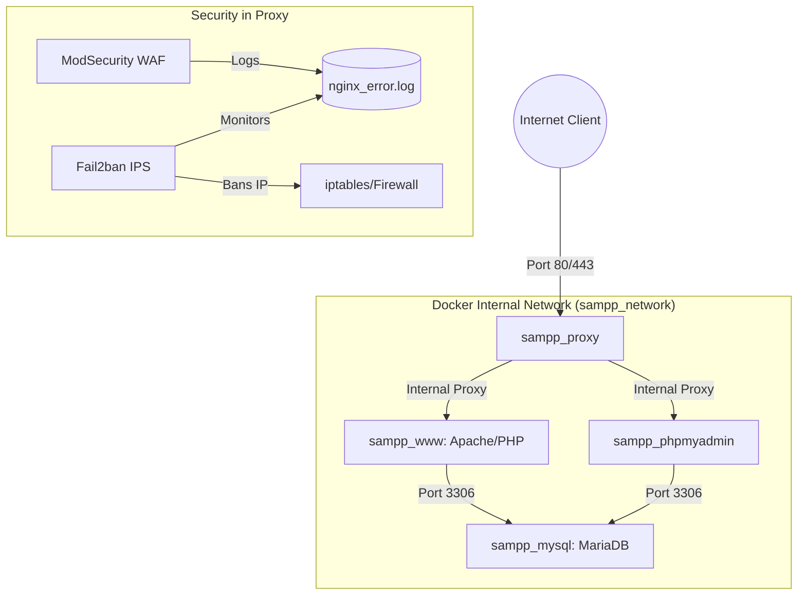

# Docker SAMPP
**README.md** [Spanish](README.md) | [English](README.en.md)

An easy-to-install **Apache** distribution containing **MariaDB**, **PHP**, and **phpMyAdmin**, simple to download and run. That easy!


### Start the container
```bash
  docker compose up -d
```


### WEB Address
We host web files in `www` (removing the demo). Navigate to the following address `https://localhost/` (By default, configure your domain in the `.env`).


### SSL/TLS Certificates
Modifiable from `./docker/certs`. To install a real **Let's Encrypt** certificate (configure your email in the `.env` and run):
```bash
  sudo bash ./setup-ssl.sh
```


### phpMyAdmin Address
By default `https://localhost/pma/` (configure your domain in the `.env`).


### Database Credentials
Modifiable from `.env`, for both **MariaDB** and **phpMyAdmin**.
| Service | Host | User | Pass |
| :------ | :--- | :--- | :--- |
| **MariaDB** | sampp_mysql | root | DockerSAMPP |
| **phpMyAdmin** | sampp_mysql | root | DockerSAMPP |


### Web Application Firewall (WAF)
Implemented **ModSecurity** and **Fail2ban** from the `sampp_proxy` container.

| ModSecurity | Fail2ban |
| :------ | :--- |
| SQL INJECTION | BRUTE FORCE |
| XSS CROSS-SITE SCRIPTING | XMLRPC ABUSE |
| MALICIOUS FILE UPLOAD | SCANNER/BOT DETECTION |
| COMMAND INJECTION | DDoS RATE LIMIT ABUSE |
| PATH TRAVERSAL |  |


### Package Contents
| Package | Version |
| :----| :------ |
| Apache | **2.4** |
| MariaDB | **11.8** |
| PHP | **8.3** |
| phpMyAdmin | **5.2** |
| OpenSSL | **3.0** |
| Nginx | **1.27** |
| ModSecurity | **3.0** |
| Fail2ban | **1.0** |


### Default Ports
| Service | Ports |
| :------ | :--- |
| **Apache** + **phpMyAdmin** | 80, 443 |
| **MariaDB** | 3306 (Internal) |


### Network Architecture Diagram
