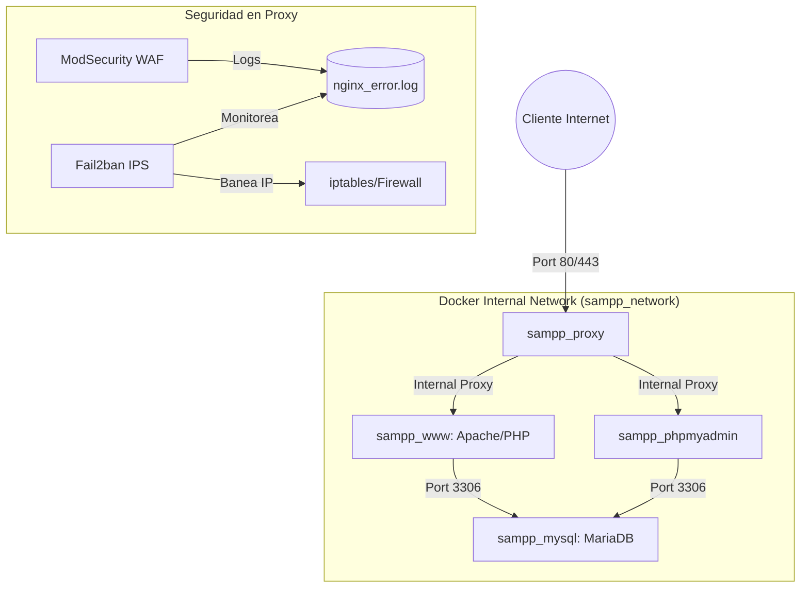

# Docker SAMPP
**README.md** [Spanish](README.md) | [English](README.en.md)

Una distribución de **Apache** fácil de instalar que contiene **MariaDB**, **PHP** y **phpMyAdmin**, simple de descargar y ejecutar. ¡Así de fácil!


### Iniciar el contenedor
```bash
  docker compose up -d
```


### Dirección WEB
Alojamos los archivos web en `www` (eliminando la demostración). Navega en la siguiente dirección `https://localhost/` (Por defecto, configura tu dominio en el `.env`).


### Certificados SSL/TLS
Modificables desde `./docker/certs`. Para instalar un certificado real de **Let's Encrypt** (configura tu email en el `.env` y ejecuta):
```bash
  sudo bash ./setup-ssl.sh
```


### Dirección phpMyAdmin
Por defecto `https://localhost/pma/`(configura tu dominio en el `.env`).


### Credenciales Database
Modificables desde `.env`, para **MariaDB** y **phpMyAdmin**.
| Service | Host | User | Pass |
| :------ | :--- | :--- | :--- |
| **MariaDB** | sampp_mysql | root | DockerSAMPP |
| **phpMyAdmin** | sampp_mysql | root | DockerSAMPP |


### Web Application Firewall (WAF)
Implementado **ModSecurity** y **Fail2ban** desde el contenedor `sampp_proxy`.

| ModSecurity | Fail2ban |
| :------ | :--- |
| SQL INJECTION | BRUTE FORCE |
| XSS CROSS-SITE SCRIPTING | XMLRPC ABUSE |
| FILE UPLOAD MALICIOSO | SCANNER/BOT DETECTION |
| COMMAND INJECTION | DDoS RATE LIMIT ABUSE |
| PATH TRAVERSAL |  |


### Contenido de paquetes
| Paquetes | Versiones |
| :----| :------ |
| Apache | **2.4** |
| MariaDB | **11.8** |
| PHP | **8.3** |
| phpMyAdmin | **5.2** |
| OpenSSL | **3.0** |
| Nginx | **1.27** |
| ModSecurity | **3.0** |
| Fail2ban | **1.0** |


### Puertos por defecto
| Servicios | Puertos |
| :------ | :--- |
| **Apache** + **phpMyAdmin** | 80, 443 |
| **MariaDB** | 3306 (Internal) |


### Diagrama de Arquitectura de Red
